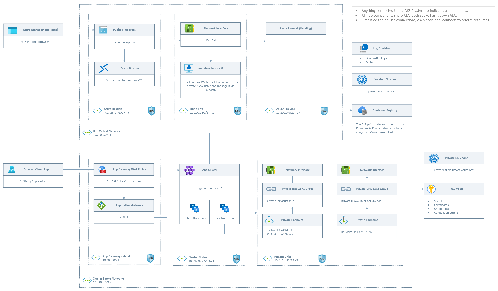

Bicep deployment for building a secure and scalable private AKS cluster with the following capabilities.

- Private AKS cluster built on Azure Linux (Mariner) with Azure RBAC for cluster access.
- HUB VNET for management access (Bastion) and Egress firewall / Spoke VNETS for each cluster deployment.
- Connection to ACR and Key Vault over private link.
- Application Gateway Ingress Controller (AGIC), NGINX alternate found in this branch (link), Application Gateway for Containers under development.
- POD workload identity, CSI driver for Key Vault, Azure Policy / OPA Gatekeeper, and container insights enabled.

A few things are still in progress (egress, SSL validation, and code optimization).



## Prerequisites

Create SSL certificates for the Application Gateway Ingress Controller prior to deployment. Update the three parameter files per your environment.

## Prepare Entra groups and users

##### Create cluster admins group, admin user, and add user to group.

```
az ad group create --display-name 'aks-admins' --mail-nickname 'aks-admins' --description "Principals in this group are AKS admins" --query id -o tsv
az ad user create --display-name=aks-cluster-admin --user-principal-name <replace>> --force-change-password-next-sign-in --password ''
az ad group member add -g aks-admin --member-id <update>
```

#### Create namespace reader group

```
az ad group create --display-name 'aks-namespace-reader' --mail-nickname 'aks-namespace-reader' --description "Principals in this group can read a specified namespace" --query id -o tsv
```

## Deploy cluster

#### Deploy Hub Network

```
az group create --name aks-hub-network --location eastus
az deployment group create --template-file ./cluster-deployment/hub-network.bicep --parameters ./parameters/lab-deployment/hub-network.bicepparam -g aks-hub-network
```

#### Deploy jumpbox (optional)

```
az group create --name aks-jump-box --location eastus
az deployment group create --template-file ./cluster-deployment/jump-box.bicep --parameters ./parameters/lab-deployment/jump-box.bicepparam -g aks-jump-box
```

#### Deploy spoke network and shared cluster resources

```
az group create --name aks-cluster-one --location eastus
az deployment group create --template-file ./cluster-deployment/spoke-network-and-acr.bicep --parameters ./parameters/lab-deployment/spoke-network.bicepparam -g aks-cluster-one
```

#### Deoply AKS

```
az deployment group create --template-file ./cluster-deployment/aks-cluster.bicep --parameters ./parameters/lab-deployment/aks-cluster.bicepparam -g aks-cluster-one
```